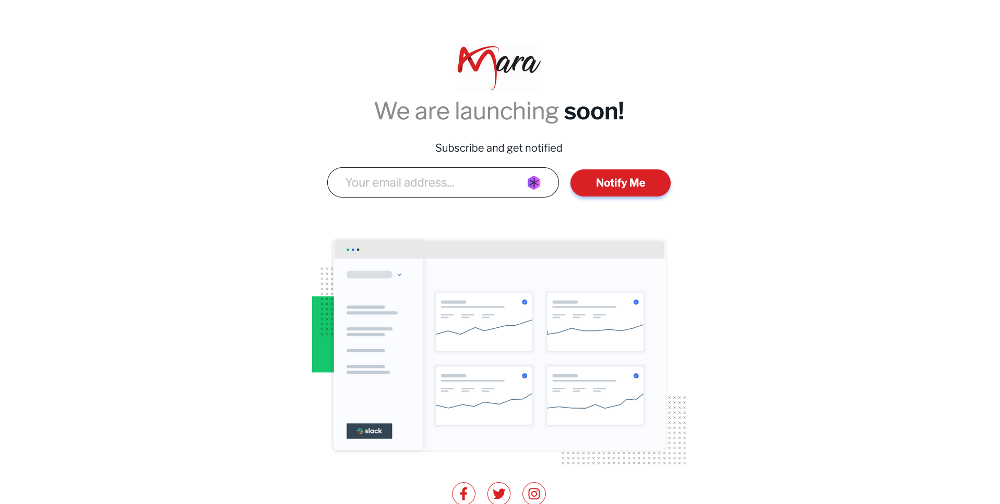

<h1 align="center">Amara Designs coming soon</h1>

<div align="center">
  <h3>
    <a href="https://amaradesigns.in">
      🚀 Live Site
    </a>
  </h5>
</div>

  <p align="center">
   Amara Designs is coming soon to help your brand thrive in the fast-paced digital world with stunning designs backed by the latest ML/AI technologies.
  </p>

### Screenshot

<a align="center" href="https://amaradesigns.in">


</a>

### The challenge

Users should be able to:

- View the optimal layout for the site depending on their device's screen size
- See hover states for all interactive elements on the page
- Submit their email address using an `input` field
- Receive an error message when the `form` is submitted if:
  - The `input` field is empty. The message for this error should say _"Whoops! It looks like you forgot to add your email"_
  - The email address is not formatted correctly (i.e. a correct email address should have this structure: `name@host.tld`). The message for this error should say _"Please provide a valid email address"_
- **Bonus:** Dark mode toggle

#### Built with

- Semantic HTML5 markup
- CSS custom properties
- Flexbox
- CSS Grid
- JavaScript
- Mobile-first workflow
- NPM

## Installation

- Clone this repo:

```sh
git clone https://github.com/amara-designs/coming-soon-page.git
```

- Install dependencies:

```sh
npm install
```

- Build command:

```sh
npm run build
```

- Run command:

```sh
npm start
```


### Useful resources

- [RegexMagic](https://www.regular-expressions.info/email.html) - This article by <b>Jan Goyvaerts</b> provides an in-depth explanation of how to use regular expressions to validate email addresses. The article not only explains how to write regular expressions for email validation but also covers the common mistakes made while writing regular expressions for email validation.

It provides clear and concise examples of regular expressions for email validation and also explains the logic behind each regular expression.

## Author

<b>👤 Amara Designs</b>

## Show your support

Give a ⭐️ if you liked this project!

## Acknowledgments

I would like to express my gratitude to Frontend Mentor for providing this project idea and design. Their platform is an excellent resource for web developers looking to improve their skills.

## License

This project is licensed under the [MIT](https://github.com/manik-dhanjal/coming-soon-page/blob/main/LICENSE.md) license, which means you can use, modify, and distribute the code as you wish. If you have any questions or feedback, feel free to reach out. Thank you for considering my code!
